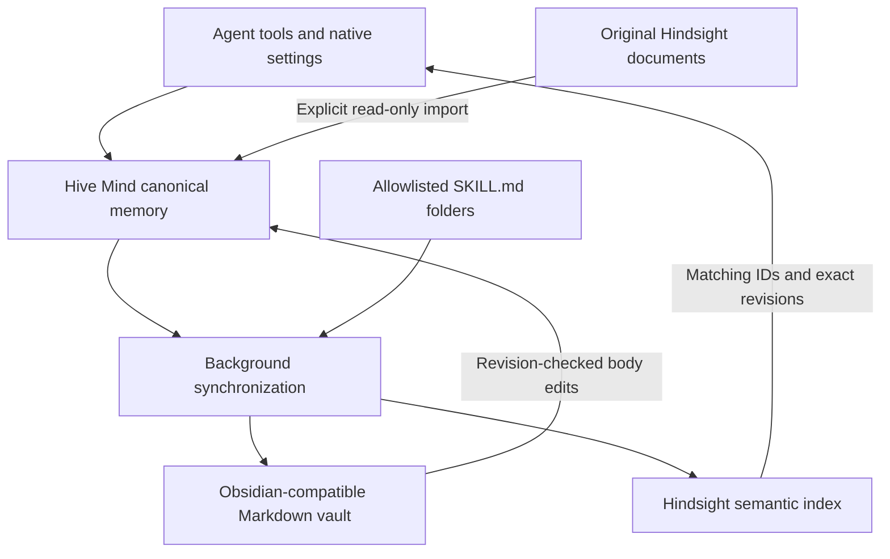

# Hive Mind

**Shared memory for AI agents that you can inspect, correct, and extend.**

Hive Mind gives the agents in [J1 Code](https://github.com/Jahdir-Cartagena-Rivers/J1Code) one place to remember project decisions, lasting preferences, and reusable knowledge. It combines authoritative records, semantic retrieval, an editable Markdown vault, and a skills catalog behind the same tools and settings.

This repository showcases the design and working J1 integration. The implementation lives in J1 Code; the examples here use invented data. Start with the [implementation commit](https://github.com/Jahdir-Cartagena-Rivers/J1Code/commit/d709391df467a41c08c4b39767868b3808ce4666), the [architecture](docs/architecture.md), or the [example walkthrough](examples/README.md).

## Why build it?

An agent can remember a useful decision, but the next agent still needs to find it, understand where it came from, and recognize a correction. A note editor and a semantic search engine also need to agree about which version is current.

Hive Mind keeps an authoritative record for each fact. Its vault and retrieval index follow that record, while retaining the source and revision needed to make corrections safe. General memory and project memory have different automatic context rules, so a detail from one project does not silently become another project's instruction.

## One system, several capabilities

| Capability | What it provides |
| --- | --- |
| Canonical memory | Durable facts with general/project scope, source identity, and revision fingerprints. |
| Semantic retrieval | Hindsight ranks relevant knowledge; Hive Mind returns the corresponding current records. Local search remains available during retrieval outages. |
| Editable vault | Managed Markdown notes can be opened in Obsidian. Body edits synchronize back with revision checks; conflicts preserve the edited file. |
| Skills catalog | Descriptions from allowlisted `SKILL.md` folders become searchable knowledge. Discovery does not execute a skill or its hooks. |
| Existing knowledge | Explicit import reads original documents from a Hindsight bank without changing that source bank. Corrections and forgotten entries survive repeated imports. |
| Native management | Search, add, edit, forget, configure, pause, and synchronize through J1 settings and agent tools. |

Saved facts wake the background worker. Vault and skill changes are checked every 30 seconds. Completed retrieval receipts survive restarts, and failed work remains pending. Forgotten notes are archived and their owned retrieval documents are removed.

## A small example

1. An agent records that the fictitious **Nebula** project uses copper cooling fins.
2. Hive Mind exports the decision to the vault and indexes it for semantic search.
3. Another agent can find it by asking which material dissipates heat.
4. You correct the note to aluminum. Synchronization checks its base revision and updates canonical memory.
5. A stale retrieval result cannot substitute the old copper record for the corrected one.
6. Forgetting the record archives its managed note and removes its retrieval projection.

The [example files](examples/README.md) show the actual record and managed-note formats using synthetic data.

## Use it in J1 Code

Open **Settings > Hive Mind** for the intended server environment. Choose a vault folder, optionally configure a Hindsight URL and dedicated retrieval bank, and add the skill folders you want cataloged. Paths belong to the server, including when you connect remotely. Save the setup and inspect the synchronization status.

Existing memory works with local search before retrieval is configured. Open the configured vault in Obsidian or another Markdown editor. Use **Existing knowledge** to import an old Hindsight source bank explicitly.

- [User guide](https://github.com/Jahdir-Cartagena-Rivers/J1Code/blob/d709391df467a41c08c4b39767868b3808ce4666/docs/user/hive-mind.md)
- [Server setup and operation](https://github.com/Jahdir-Cartagena-Rivers/J1Code/blob/d709391df467a41c08c4b39767868b3808ce4666/docs/operations/hive-mind.md)
- [Synthetic configuration](examples/hive-mind.config.example.json)

## Implementation and validation

The working implementation includes the server engine, provider MCP tools, Dot's scoped memory route, shared typed contracts, web/desktop settings, and a native mobile settings screen.

Validation performed during the October 5, 2026 implementation included 145 focused tests, two RPC integration checks, server/web/mobile/desktop typechecks, and production builds. Isolated runtime checks covered semantic recall, vault corrections, project isolation, restart receipts, offline fallback, fresh-bank setup, forget removal, and preservation of an existing Hindsight source bank. The packaged desktop page was checked through J1's Browser panel.

The Windows build is an unsigned local preview. Native mobile device verification remains outstanding. A broader server router test has an unrelated unknown-route redirect failure recorded in the local validation report. No benchmark of improved model intelligence or coding accuracy has been performed.

## Current boundaries

- Managed facts support up to 2,000 characters each. Long imported source documents are split into excerpts.
- New memories are created through Hive Mind. Arbitrary new vault notes are left alone.
- Skill discovery catalogs descriptions; skill execution stays with the provider's existing tools.
- Extensions are implemented through source adapters. A general plugin marketplace is future work.

## Credits and license

Hive Mind is developed in J1 Code, an independently maintained derivative of [T3 Code](https://github.com/pingdotgg/t3code). [Hindsight](https://github.com/vectorize-io/hindsight) supplies the semantic memory engine. [Obsidian](https://obsidian.md/) is an optional editor for the Markdown vault; it is not bundled. This project has no claimed affiliation with either product.

The showcase files use the [MIT license](LICENSE). Upstream T3 attribution is retained. The linked projects have their own licenses and terms.
