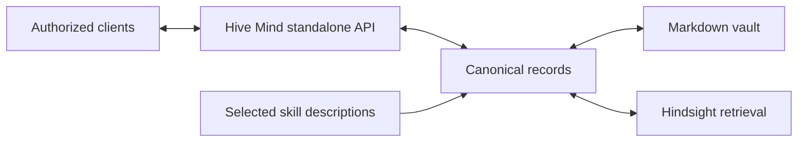

# Hive Mind

**Shared memory for AI agents that you can inspect, correct, and extend.**

Hive Mind brings durable memory, semantic retrieval, an Obsidian-compatible vault,
and a skills catalog into one system. This repository contains the standalone
core and an authenticated local HTTP service. It uses explicit state directories,
so it can run independently of J1 Code and its user profiles.

**Source-available, with restrictive terms for new protected material.** Public
access is not a general permission to reuse the new service implementation. The
previously released core in [src/legacy](src/legacy) remains MIT. Read
[LICENSE](LICENSE) and [the licensing boundaries](docs/licensing.md).

## Start a separate environment

Requires Node.js 24.13 or newer. Install with `npm ci --ignore-scripts`. Generate
a random bearer token, provide it through `HIVE_MIND_TOKEN`, then run:

```text
npm start -- --state-dir <absolute-directory> --port 8788
```

The server binds to 127.0.0.1. It refuses to use J1's installed userdata or a
directory containing a J1 state database. Choose a dedicated directory; existing
J1 memories are not automatically copied, moved, or modified. Keep the token out
of command arguments, URLs, committed files, and logs.

The service supports memory search, revision-checked edits, forgetting, managed
vault synchronization, skill cataloging, and explicit source-bank import.
See the [API and setup guide](docs/service.md). Use the
[synthetic fixtures](examples/README.md) to explore the record format.

## How it fits together



J1 Code retains its existing MIT J1 edition and public downloads. This standalone
service is a separate deployment; J1 does not silently switch storage or launch
it. The [architecture overview](docs/architecture.md) explains correction and
retrieval behavior.

## Validation and boundaries

The inherited core has focused regression tests. The standalone service adds
authentication, malformed-request, revision-conflict, restart, and isolated-state
checks. Run `npm test` and `npm run check:publication`. Native mobile device
verification of J1's existing UI remains separate. No benchmark of improved model
intelligence or coding accuracy has been performed.

Anyone can read or download public source. A license provides legal restrictions
on eligible new material; it does not stop copying technically or prevent an
independent implementation of the same idea. Older MIT copies remain reusable.

## Credits

Hive Mind originated in J1 Code, a derivative of
[T3 Code](https://github.com/pingdotgg/t3code).
[Hindsight](https://github.com/vectorize-io/hindsight) supplies semantic retrieval.
[Obsidian](https://obsidian.md/) is an optional editor and is not bundled.
Dependencies retain their own licenses. No affiliation is claimed.

For permission requests, contact the repository owner through their GitHub
profile. Implementation contributions require a separate rights agreement.
